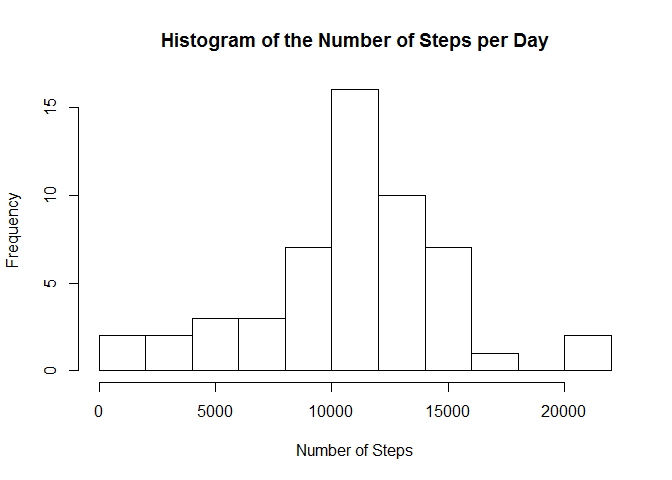
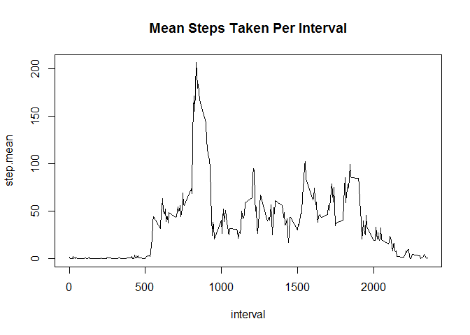
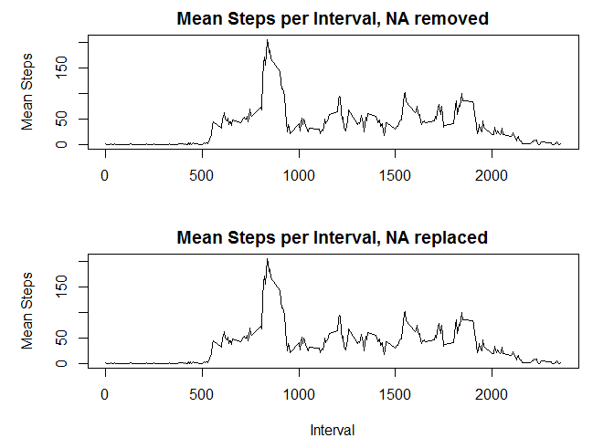
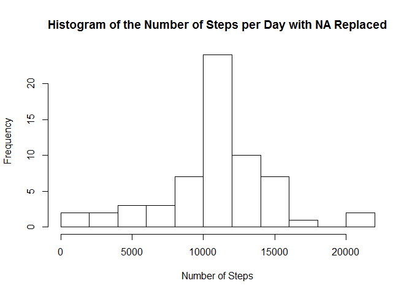
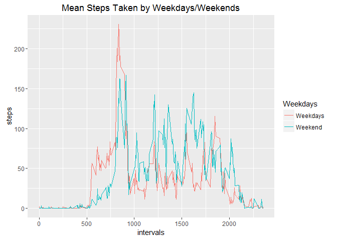

# Reproducible Research: Peer Assessment 1


```r
knitr::opts_chunk$set(echo = TRUE)
```


```r
## Loading and preprocessing the data
### load data
unzip("activity.zip")
act <- read.csv("activity.csv", sep=',')

### data size
dim(act)
```

```
## [1] 17568     3
```

```r
### data details
head(act)
```

```
##   steps       date interval
## 1    NA 2012-10-01        0
## 2    NA 2012-10-01        5
## 3    NA 2012-10-01       10
## 4    NA 2012-10-01       15
## 5    NA 2012-10-01       20
## 6    NA 2012-10-01       25
```

```r
### rm the rows with NA
act1 <- act[complete.cases(act),]
### complete data size 
dim(act1)
```

```
## [1] 15264     3
```

```r
## What is mean total number of steps taken per day?
step_per_day <- with(act1, aggregate(steps, list(date),sum))
names(step_per_day) <- c("date", 'steps')

## What is the average daily activity pattern?
###calculate the mean steps per day
step_per_day_mean <- mean(step_per_day$steps)
cat('Mean steps per day:',step_per_day_mean)
```

```
## Mean steps per day: 10766.19
```

```r
###calculate the median steps per day
step_per_day_median <- median(step_per_day$steps)
cat('Median steps per day:',step_per_day_median )
```

```
## Median steps per day: 10765
```

```r
###mean steps per interval across all days
mean_step_interval <- with(act1, aggregate(steps,list(interval),mean))
names(mean_step_interval) <- c('interval','steps')

###the interval for the max step
int_max <- mean_step_interval$interval[which.max(mean_step_interval$steps)]
cat('The max average number of step is',max(mean_step_interval$steps),'at the 5 min interval',int_max )
```

```
## The max average number of step is 206.1698 at the 5 min interval 835
```

```r
## Imputing missing values
###Imputing missing values with the mean of the correspondant 5 min interval
### calculate the interval means

names(mean_step_interval) <- c('interval','step.mean')

### merge the original file with the interval means
act2 <- merge(act, mean_step_interval, by = 'interval')

### find the index of the missing values
nai <- is.na(act2$steps)
### replace the miss with the mean in the new dataset
act2$steps[nai] <- act2$step.mean[nai]
### calculate the new means
mean_step_interval2 <- with(act2, aggregate(steps,list(interval),mean))
names(mean_step_interval2) <- c('interval','step.mean')

###calculate the new total number of steps per day after replacing the NA
step_per_day2 <- with(act2, aggregate(steps, list(date),sum))
names(step_per_day2) <- c("date", 'steps')


## Are there differences in activity patterns between weekdays and weekends?
act2$date <- as.Date(as.character(act2$date),format ='%Y-%m-%d')
act2$wkds <- weekdays(act2$date) %in% 'Saturday'|weekdays(act2$date) %in% 'Sunday'
wkd <- which(act2$wkds == FALSE)
act2$wkds[wkd] <- 'Weekdays'
wkend <- which(act2$wkds == TRUE)
act2$wkds[wkend] <- 'Weekend'
mean_step_interval3 <- with(act2, aggregate(steps,list(interval,wkds),mean))
names(mean_step_interval3) <- c('intervals','Weekdays','steps')

### Including Plots
library(ggplot2)

###plot histogram of the total number of steps taken each day
hist(step_per_day$steps, main="Histogram of the Number of Steps per Day", xlab='Number of Steps', breaks=10)
```

<!-- -->

```r
###Make a time series plot (i.e. type = "l") of the 5-minute interval (x-axis) and the ###average number of steps taken, averaged across all days (y-axis)
plot(mean_step_interval,type='l', main='Mean Steps Taken Per Interval')
```

<!-- -->

```r
### plot the effects of replacing NA with means of the interval
par(mfrow=c(2,1),  mar=c(4,5,2,2))
plot(mean_step_interval,type='l', main='Mean Steps per Interval, NA removed', xlab='', ylab='Mean Steps')
plot(mean_step_interval2,type='l', main='Mean Steps per Interval, NA replaced', ylab='Mean Steps', xlab='Interval')
```

<!-- -->


```r
###plot histogram of the total number of steps taken each day after replacing the NAs
hist(step_per_day2$steps, main="Histogram of the Number of Steps per Day with NA Replaced", xlab='Number of Steps', breaks=10)
```

<!-- -->

```r
###plot average number of steps taken per  interval across weekdays and weekends
with(mean_step_interval3,qplot(intervals,steps,color=Weekdays,geom='line', main = "Mean Steps Taken by Weekdays/Weekends"))
```

<!-- -->

